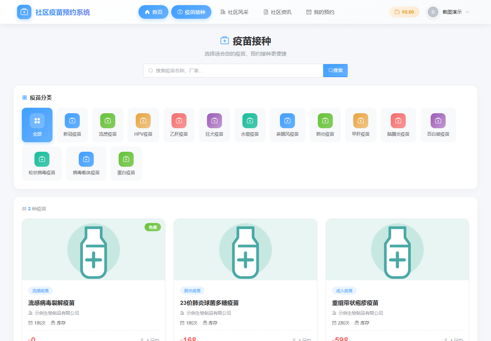
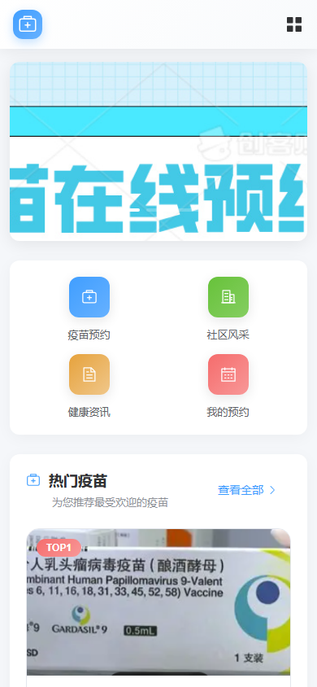

# 社区疫苗预约管理系统

面向社区接种场景的全栈毕业设计项目，包含疫苗展示、社区选择、预约审核、模拟余额支付、资讯公告、后台管理和统计功能。

## 技术栈

- 前端：Vue 3、Vite、Pinia、Element Plus、ECharts
- 后端：Spring Boot 3、MyBatis、MySQL、Redis、JWT、Knife4j
- 测试：JUnit 5、Mockito、Vitest、Postman、JMeter

## 效果图

| 用户端首页 | 疫苗列表 |
| --- | --- |
|  |  |



完整截图说明见 [`screenshots/README.md`](screenshots/README.md)。

## 本地启动

### 1. 准备依赖

1. 启动 MySQL，并导入 `sql/vaccine_system2.sql`。
2. 启动 Redis（默认端口 `6379`）。
3. 确保 Java 17 和 Node.js 18+ 可用。

### 2. 启动后端

从本目录（`vaccine`）运行，保证上传图片目录稳定解析为 `vaccine/uploads`：

```powershell
java -jar backend/target/vaccine-system-1.0.0.jar
```

后端默认地址为 `http://127.0.0.1:8081`，接口文档为 `http://127.0.0.1:8081/doc.html`。

### 3. 启动前端

```powershell
cd frontend
npm install
npm run dev
```

前端默认地址为 `http://127.0.0.1:5173`。

## 可配置环境变量

不要把生产环境账号、密码或 JWT 密钥写进代码。可通过以下环境变量覆盖本地默认值：

| 变量 | 用途 |
| --- | --- |
| `DB_USERNAME` / `DB_PASSWORD` | MySQL 登录信息 |
| `JWT_SECRET` | JWT 签名密钥 |
| `VACCINE_UPLOAD_PATH` | 上传目录；生产环境建议使用绝对路径 |
| `CORS_ALLOWED_ORIGIN_PATTERNS` | 允许跨域的前端地址，逗号分隔 |

## 测试

```powershell
# 后端：在 backend 目录执行
mvn test

# 前端：在 frontend 目录执行
npm test
npm run build
```

Postman 集合位于 `test-tools/postman`，JMeter 计划位于 `test-tools/jmeter`。两者均使用后端默认端口 `8081`。

## 角色与边界

- `admin`：维护疫苗、社区、用户、资讯、公告、轮播图、缓存和全局统计。
- `community_admin`：审核和确认自己所属社区的预约，只能查看本社区概览。
- `user`：创建、支付、取消自己的预约，管理自己的收藏和充值记录。

支付与通知目前是**本地模拟实现**：支付操作改变站内余额，通知内容写入本地文件；接入真实支付或短信/邮件服务前，请补充回调验签、幂等处理和密钥管理。
