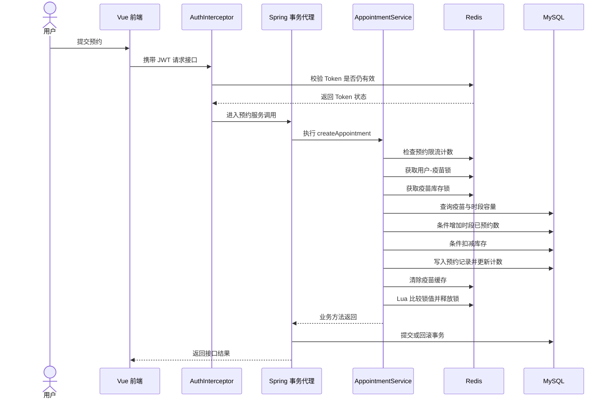

# 技术架构与并发控制说明

本文是社区疫苗预约管理系统的工程技术说明，面向查看代码的开发者、招聘方和技术面试官。重点说明系统如何组织业务、Redis 在项目中的实际用途，以及预约库存和账户余额在并发请求下如何保护。文档按当前仓库源码描述，不把规划中的能力写成已实现功能。

## 1. 项目概览

系统面向社区疫苗预约场景，包含用户端和管理端。用户可以查看疫苗及社区信息、提交预约、支付模拟订单和管理个人记录；社区管理员处理所属社区的预约，系统管理员维护全局数据。

项目采用前后端分离结构：

| 层次 | 主要技术 | 责任 |
| --- | --- | --- |
| Web 前端 | Vue 3、Vite、Pinia、Element Plus、ECharts | 页面展示、路由、状态管理、表单校验和接口调用 |
| HTTP 接口 | Spring Boot Controller、拦截器 | 接收请求、身份校验、参数转换和响应封装 |
| 业务层 | Spring Service、Spring Transaction | 预约、审核、支付、退款、充值等业务流程及事务边界 |
| 数据访问 | MyBatis Mapper、MySQL | 持久化业务数据，并通过带条件的 SQL 保护关键数据约束 |
| 缓存与协调 | Redis、Spring Data Redis | 分布式锁、热点缓存、Token 状态和请求计数 |

核心请求路径可以概括为：

```text
Vue 页面
  -> HTTP 请求
  -> AuthInterceptor 校验 JWT 与 Redis 中的 Token 状态
  -> Controller 接口入口
  -> Service 执行业务校验、事务和并发控制
  -> Mapper 执行 SQL
  -> MySQL 保存最终业务数据
       Redis 辅助协调、缓存和访问控制
```

MySQL 是库存、预约状态和账户余额的持久化依据。Redis 能帮助多个后端实例协调访问，但关键数据仍由数据库中的条件更新和事务负责落库。

## 2. 预约创建：一条完整的并发控制链路

预约不是简单地“插入一条记录”。一次成功的预约需要同时满足：用户有权限、请求频率未超限、同一用户没有重复提交、疫苗仍有库存、所选社区时段仍有名额，并且预约记录和计数更新不能只完成一部分。

当前主要流程位于 `AppointmentService.createAppointment`：

1. 校验请求参数和当前登录用户身份，只有普通用户能创建预约。
2. 使用 Redis 计数器检查该用户的预约请求频率；当前阈值为每分钟最多 5 次。
3. 获取 `appointment:{userId}:{vaccineId}` 锁，短时间内合并同一用户对同一疫苗的重复提交；获取失败时直接返回“正在处理中”。
4. 获取 `vaccine:stock:{vaccineId}` 锁，减少不同用户同时操作同一疫苗时发生冲突的机会。
5. 查询疫苗状态和当前库存，确保疫苗存在、已上架且库存大于零。
6. 查询或创建社区、日期和时段对应的容量记录，再用带容量条件的 SQL 增加已预约人数。
7. 用带库存条件的 SQL 扣减疫苗库存；若数据库返回受影响行数为 0，说明库存条件已不成立，业务流程失败。
8. 增加疫苗预约计数、写入预约记录，并清除疫苗相关缓存。
9. 在 `finally` 中释放已获取的 Redis 锁。业务异常会继续向外抛出，由 Spring 事务回滚数据库中的本次修改。



这个流程使用了几种互补手段：限流控制请求频率，用户级锁拦截短时间重复提交，疫苗级锁协调同一库存对象的业务请求，数据库条件更新守住库存和时段容量的最终边界，事务保证同一次预约涉及的数据库写入一起提交或回滚。

## 3. Redis 分布式锁

### 3.1 为什么需要锁

单个 Java 实例中的 `synchronized` 或 `ReentrantLock` 只在当前进程有效。如果服务启动两个实例，请求可能分别落到实例 A 和实例 B；它们各自的 JVM 锁互相不可见。Redis 是两个实例都能访问的共享协调点，因此可用 Redis key 表示某个业务资源当前是否被占用。

本项目没有引入 Redisson，而是在 `DistributedLockService` 和 `RedisUtils` 中基于 Spring Data Redis 实现了轻量锁逻辑。

### 3.2 获取锁：原子写入、过期时间和持有者标识

获取锁时，服务生成 UUID 作为本次持有者标识，并调用 `StringRedisTemplate.opsForValue().setIfAbsent(key, value, timeout, unit)`。Redis 层对应“仅当 key 不存在时写入，并同时设置过期时间”的原子操作；只有一个并发请求能成功创建同一个 key。

锁 key 使用 `lock:` 前缀，主要业务 key 如下：

| 业务对象 | Redis 锁 key（前缀展开后） | 当前等待与租期 |
| --- | --- | --- |
| 用户对某疫苗的预约提交 | `lock:appointment:{userId}:{vaccineId}` | 不等待，租期 30 秒 |
| 某疫苗库存 | `lock:vaccine:stock:{vaccineId}` | 最多等待 3 秒，租期 5 秒 |
| 某用户账户余额 | `lock:user:balance:{userId}` | 最多等待 3 秒，租期 5 秒 |

库存锁和余额锁在等待期间每 100 毫秒重试一次。通用方法另有默认租期 10 秒、默认等待 5 秒；上述业务方法明确传入了自己的时长。

锁设置过期时间可以避免持锁进程崩溃后留下永久 key。它同时意味着锁是有租期的：若业务执行时间超过租期，Redis 会允许其他请求重新获取锁。因此，租期不是“业务一定在此时间内完成”的证明，数据库条件更新仍然很重要。

### 3.3 安全释放：比较持有者后再删除

不能直接执行 `DEL lockKey`。设想请求 A 获取锁后暂停，租期到期；请求 B 随后获取同一把锁。如果 A 恢复后直接删除 key，就会错误删除 B 当前持有的锁。

本项目释放锁时使用 Lua 脚本，在 Redis 内原子地完成“读取 key、比较 UUID、只有相同才删除”。本地 `ThreadLocal<Map<key, UUID>>` 保存当前 Java 线程获取到的持有者值，使释放时能够提交正确的 UUID；释放后会移除线程变量，避免线程池线程长期保留业务数据。

这解决了锁过期后旧持有者误删新锁的问题，但没有自动续期，也没有 fencing token（递增栅栏令牌）。因此它适用于当前演示规模的短临界区；若扩展到长时间任务或强一致性要求，应重新评估锁租期、续期、故障切换和下游拒绝过期持有者写入的机制。

### 3.4 锁和数据库事务不是一回事

Redis 锁协调“谁可以先处理某个业务对象”；MySQL 事务负责数据库中的多条写入一起提交或回滚。Redis key 不会自动加入 MySQL 事务，回滚 SQL 也不会自动撤销 Redis 中已经执行的操作。

当前预约、支付和充值方法在带 `@Transactional` 的 Service 方法内部获取和释放锁。`finally` 会在目标方法返回前释放锁，而 Spring 事务代理通常在目标方法返回后才执行数据库提交。也就是说，锁当前没有覆盖到数据库提交完成这一刻。库存和时段容量仍有数据库条件更新作为最终保护；如果未来要把锁严格持有到事务完成，需要把释放动作挂到事务完成回调，或重构锁和事务的外层调用边界，并为并发场景补充验证。

## 4. 乐观并发控制与条件更新

“乐观锁”通常泛指先读取数据、计算新值，更新时再确认数据没有被其他事务改过。经典实现会新增 `version` 字段，并执行类似 `UPDATE ... SET value=?, version=version+1 WHERE id=? AND version=?`。如果更新行数为 0，说明版本已变化，调用方需要重试或返回冲突。

当前项目没有使用统一的 `version` 字段。更准确地说，它使用了基于旧值比较和业务条件的原子条件更新；对于库存和时段容量，这是 SQL 层的条件写入保护。

### 4.1 疫苗库存：条件扣减防止负库存

`VaccineMapper.decreaseStock` 执行：

```sql
UPDATE vaccine
SET stock = stock - 1
WHERE id = ? AND stock > 0;
```

检查库存和扣减库存发生在同一条 SQL 语句中，不会先在 Java 中读出一个库存值，再无条件写回一个可能已经过期的结果。库存大于零时数据库更新一行；库存为零或疫苗不存在时更新零行。Service 根据行数判断预约是否可以继续。

这是一种“带业务条件的原子更新”，能防止库存扣成负数。它没有通过版本号比较，因此在介绍时不应说成“数据库 `version` 字段乐观锁”。源码注释称它为乐观锁，工程说明采用更精确的描述。

### 4.2 预约时段：条件递增防止超容量

`TimeSlotCapacityMapper.increaseBooked` 执行：

```sql
UPDATE time_slot_capacity
SET booked = booked + 1
WHERE id = ? AND booked < capacity;
```

数据库只会在已预约人数仍小于容量时增加计数；返回 0 行表示时段已满或记录不存在。减少人数时也有 `booked > 0` 条件，避免人数变成负数。时段表通过社区、日期、时段的唯一索引限制重复配置。

### 4.3 账户余额：使用旧余额作为比较条件

支付、充值和退款都会先读取余额、在 Java 中计算新余额，再调用 `UserMapper.updateBalanceWithCheck`：

```sql
UPDATE user
SET balance = ?
WHERE id = ? AND balance = ?;
```

最后一个参数是本次读取的旧余额。若另一个请求已先更新余额，当前 SQL 就匹配不到旧值，返回 0 行，Service 将本次操作作为冲突处理。这个做法属于基于旧值的 compare-and-set 式乐观并发控制；同时，余额业务还使用 Redis 用户余额锁协调同一账户的并发操作。

### 4.4 为什么同时用锁和条件更新

锁和条件更新的保护层次不同：

| 机制 | 解决的问题 | 发生冲突时的表现 |
| --- | --- | --- |
| Redis 分布式锁 | 多个服务实例同时进入同一业务临界区，减少重复计算和竞争 | 等待后获得锁，或在等待/获取失败时返回繁忙 |
| MySQL 条件更新 | 即使读到旧数据、锁租期到期或并发请求交错，也不破坏库存、容量、余额的数据库条件 | 更新行数为 0，业务失败或要求重试 |
| Spring 数据库事务 | 同一业务中的多条数据库写入保持整体提交/回滚 | 异常时回滚事务中的数据库操作 |

这类设计让 Redis 负责协调，让数据库守住持久化约束。最终业务一致性不能只依赖 Redis 锁；库存和余额等关键写入仍应在数据库端以条件表达式完成。

## 5. Redis 在本项目的四类用途

Redis 不只是分布式锁。本项目通过 `RedisUtils` 封装对象读写和字符串读写，并在不同 Service 中用于以下场景。

### 5.1 分布式锁

使用 `lock:` 前缀、随机 UUID、写入时附带 TTL，以及 Lua 比较后删除。重点实现位于 `DistributedLockService` 和 `RedisUtils`。

### 5.2 热点数据缓存

`CacheService` 对疫苗列表、疫苗详情、热门疫苗、疫苗分类、社区列表和部分统计数据进行缓存。疫苗及普通列表缓存通常为 10 分钟，热门数据通常为 5 分钟。读取时先查 Redis，未命中再访问 MySQL 并写入带过期时间的缓存；疫苗数据变更或预约扣减库存后，会清除相关疫苗缓存。

这是常见的 Cache-Aside 读路径：数据库仍是事实来源，缓存用于减少重复查询。当前实现主要通过显式删除来失效缓存，没有跨 Redis 和 MySQL 的事务，也没有围绕缓存重建竞争提供强一致性保证。对要求实时精确的库存展示，应以预约时的数据库条件更新结果为准，而不能只信列表缓存。

### 5.3 JWT 的 Redis 状态校验

JWT 本身包含签名和有效期，但系统还把 Token 与用户 ID 的映射放在 Redis 中。请求拦截器会验证 JWT，并确认 Token 在 Redis 中仍存在且是用户当前有效的 Token。退出登录时可删除 Redis 映射，使尚未到 JWT 自然过期时间的 Token 立即失效；刷新登录也会更新 Redis 中的当前 Token。

因此身份认证不是“只校验 JWT 签名”的纯无状态模式，而是 JWT 与 Redis 状态检查组合：JWT 用于承载并验证身份声明，Redis 用于主动撤销和当前会话管理。

### 5.4 请求频率计数

`RateLimitService` 使用 `rate_limit:` 前缀和带 TTL 的 Redis 计数器。当前预约规则为每个用户每分钟最多 5 次；代码中还配置了登录、注册、短信、IP 和通用用户计数入口。

当前算法实际是“首次请求设置带过期时间的计数器，后续读取、比较，再递增”的固定时长计数窗口，并非滑动窗口。单次 Redis `INCR` 是原子操作，但“读取—判断—递增”整体不是 Lua 原子脚本；高并发恰好同时通过判断时，计数可能超过阈值。因此该功能可作为基础限流示例，若要求严格限额，应将判断和递增合并为 Lua 脚本，或采用令牌桶/滑动窗口等原子方案。

## 6. 事务、幂等和一致性边界

预约创建、审核、支付、接种确认、取消和充值等核心数据库流程使用 Spring 声明式事务。数据库事务能够保证同一事务中的 MySQL 更新整体提交或整体回滚，例如创建预约过程中若插入预约失败，前面已经执行的库存和时段容量更新也会回滚。

事务只覆盖数据库资源。当前 Redis 锁、缓存删除以及本地模拟通知不具备 MySQL 事务的原子提交语义；通知发送失败会被捕获并记录日志，不回滚主业务。支付目前是站内余额模拟，不是第三方支付网关。

项目通过预约锁降低重复提交，但预约表目前的唯一索引是订单号，数据库没有以“用户 + 疫苗”建立预约唯一约束。严格的请求幂等还可以增加客户端幂等键、预约状态条件更新和适当的唯一约束。它们能让重复 HTTP 请求在应用锁过期、服务重试或请求跨实例重放时仍有持久化层保障。

## 7. 代码阅读入口

| 要了解的内容 | 入口文件 |
| --- | --- |
| 预约创建、支付、退款和状态流转 | `backend/src/main/java/com/vaccine/service/AppointmentService.java` |
| Redis 锁 key、等待、租期和释放 | `backend/src/main/java/com/vaccine/service/DistributedLockService.java` |
| Redis 字符串、对象、TTL、Lua 删除 | `backend/src/main/java/com/vaccine/utils/RedisUtils.java` |
| Redis 序列化器配置 | `backend/src/main/java/com/vaccine/config/RedisConfig.java` |
| 余额比较更新与库存条件扣减 | `backend/src/main/java/com/vaccine/mapper/UserMapper.java`、`VaccineMapper.java` |
| 预约时段条件计数 | `backend/src/main/java/com/vaccine/mapper/TimeSlotCapacityMapper.java` |
| 热点数据缓存与清理 | `backend/src/main/java/com/vaccine/service/CacheService.java` |
| Token 的创建、Redis 校验、退出和刷新 | `backend/src/main/java/com/vaccine/service/TokenService.java` |
| 限流计数逻辑 | `backend/src/main/java/com/vaccine/service/RateLimitService.java` |
| 数据表、索引和初始化数据 | `sql/vaccine_system2.sql` |

## 8. 适合作为后续工程改进的方向

这些方向对应当前实现中可以继续加强的地方，当前文档不将它们描述为已经完成的能力：

1. **完善锁的事务边界**：在事务提交或回滚完成后释放锁；对锁过期后的旧持有者写入增加 fencing token 或数据库条件保护。
2. **让限流判断整体原子化**：使用 Lua 一次性完成读取、判断、计数和过期时间设置，并针对 IP 代理头和用户维度确定可信的限流身份。
3. **补充持久化幂等**：为关键写接口增加 idempotency key，为预约状态转换使用“期望旧状态”条件更新，并评估业务唯一约束。
4. **强化缓存一致性**：把缓存删除放到事务提交之后；对关键缓存采用版本键、短 TTL 或可靠事件失效，降低提交前删除造成的重建竞争。
5. **可靠处理外部副作用**：真实支付、短信和邮件需要回调验签、幂等处理、重试及 Outbox 等机制；当前支付和通知为本地模拟能力。
6. **补充并发验收数据**：使用仓库中的 JMeter 计划或并发测试验证库存不会为负、时段人数不会超限、余额和流水一致，并记录环境、并发数、错误率和耗时分位数。没有实际测试数据前不应宣称具体吞吐量或生产级高并发能力。

## 9. 小结

项目值得重点阅读的工程内容，是预约主流程中几种机制的组合：Redis 锁用于跨实例协调，MySQL 条件更新保护库存、时段和余额边界，Spring 事务组织多条数据库写入，Redis 缓存和 Token 状态服务于读性能及会话管理。源码入口清楚、每种机制的职责有区分，也保留了锁租期、限流原子性、缓存提交时序和幂等等方面可以继续演进的空间。
